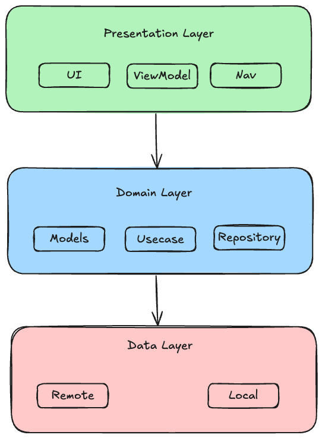

# Security Alert Companion App

A simplified Security Alert Companion App built with Android, Kotlin, Clean Arch.

## Features

- ✅ View a list of security alerts
- ✅ View detailed alert information (threat type, severity, timestamp, source)
- ✅ Acknowledge or dismiss alerts
- ✅ Local data persistence with offline support
- ✅ Search and filter alerts by severity or threat type
- ✅ Modern UI with Jetpack Compose
- ✅ MVVM architecture with Clean Architecture principles
- ✅ Unit tests for ViewModels

## Architecture

### Clean Architecture Overview

The app follows Clean Architecture principles with clear separation of concerns:



### Layer Responsibilities

#### 1. Presentation Layer
- **UI Components**: Jetpack Compose screens and components
- **ViewModels**: Manage UI state and handle user interactions
- **Navigation**: Handle screen transitions 

#### 2. Domain Layer
- **Models**: Core business entities (SecurityAlert, AlertSeverity)
- **Use Cases**: Business logic implementation (GetAllAlerts, AcknowledgeAlert, etc.)
- **Repository Interfaces**: Abstract data access contracts

#### 3. Data Layer
- **Remote Data Source**: API service for fetching alerts 
- **Local Data Source**: Room database for offline storage
- **Repository Implementation**: Coordinates between remote and local data sources

### Key Components

#### Repository Pattern

```kotlin
interface SecurityAlertRepository {
    fun getAllAlerts(): Flow<List<SecurityAlert>>
    suspend fun refreshAlerts(): Result<Unit>
    suspend fun acknowledgeAlert(id: String): Result<Unit>
    suspend fun dismissAlert(id: String): Result<Unit>
    // ... other methods
}
```

#### Dependency Injection with Hilt

The app uses Dagger Hilt for dependency injection, providing:
- Database module for Room setup
- Network module for Retrofit configuration
- Repository module for binding implementations

## Technology Stack

### Core Technologies
- **Kotlin**
- **Jetpack Compose**
- **Room**
- **Retrofit**
- **Coroutines + Flow**
- **Hilt**

### Architecture Components
- **ViewModel**
- **LiveData/StateFlow**
- **Navigation Component**
- **Repository Pattern**

## Security Considerations

### Current Implementation

1. **Network Security**
   - HTTPS enforcement for API communication
   - Certificate pinning ready for production
   - Request/response logging only in debug builds

2. **Local Storage**
   - Room database with structured data storage
   - Prepared for encryption at rest (future enhancement)

3. **Code Security**
   - Separation of concerns prevents data leakage
   - Repository pattern abstracts data access
   - Use of sealed classes and data classes for type safety

### Security Enhancements

1. **Encrypted Database**
   ```kotlin
   // Future implementation with SQLCipher
   @Database(entities = [SecurityAlertEntity::class], version = 1)
   @TypeConverters(Converters::class)
   abstract class EncryptedSecurityAlertDatabase : RoomDatabase() {
       companion object {
           fun getDatabase(context: Context, passphrase: String): EncryptedSecurityAlertDatabase {
               return Room.databaseBuilder(context, EncryptedSecurityAlertDatabase::class.java, "encrypted_alerts.db")
                   .openHelperFactory(SupportFactory(passphrase.toByteArray()))
                   .build()
           }
       }
   }
   ```

3. **Obfuscation**
   - ProGuard/R8 configuration for release builds
   - String encryption for sensitive constants
   - API key protection using NDK

## Testing

### Unit Tests

The app includes comprehensive unit tests for ViewModels:

```kotlin
@Test
fun `viewModel initializes with loading state and loads alerts`() = runTest {
    // Given
    every { filterAlertsUseCase(any()) } returns flowOf(sampleAlerts)

    // When
    viewModel = AlertListViewModel(...)

    // Then
    val uiState = viewModel.uiState.value
    assertEquals(sampleAlerts, uiState.alerts)
    assertFalse(uiState.isLoading)
    assertNull(uiState.error)
}
```

## Scalability Considerations

### Real SIEM/TI Backend Integration

1. **Authentication & Authorization**
   ```kotlin
   interface AuthService {
       suspend fun authenticate(credentials: ApiCredentials): Result<AuthToken>
       suspend fun refreshToken(token: RefreshToken): Result<AuthToken>
   }

   class AuthenticatedApiService(
       private val authService: AuthService,
       private val apiService: SecurityAlertApiService
   ) {
       suspend fun getSecurityAlerts(): Response<List<SecurityAlertDto>> {
           val token = authService.getCurrentToken()
           return apiService.getSecurityAlertsWithAuth("Bearer $token")
       }
   }
   ```

2. **Real-time Updates**
   ```kotlin
   // WebSocket implementation for real-time alerts
   class AlertWebSocketService {
       private val webSocket = OkHttpClient().newWebSocket(request, listener)

       fun subscribeToAlerts(): Flow<SecurityAlert> = callbackFlow {
           // WebSocket message handling
       }
   }
   ```

3. **Pagination & Performance**
   ```kotlin
   // Paging 3 integration for large datasets
   class AlertPagingSource : PagingSource<Int, SecurityAlert>() {
       override suspend fun load(params: LoadParams<Int>): LoadResult<Int, SecurityAlert> {
           // Implement paging logic
       }
   }
   ```

### Production Considerations

1. **Performance Optimization**
   - Image loading optimization with Coil
   - Lazy loading for large lists
   - Background processing with WorkManager

2. **Monitoring & Analytics**
   - Crash reporting with Firebase Crashlytics
   - Performance monitoring
   - User analytics for feature usage

3. **CI/CD Pipeline**
   - Automated testing on multiple devices
   - Code quality checks with ktlint/detekt
   - Automated security scanning

## Trade-offs & Assumptions

### Trade-offs Made

1. **Simplicity vs. Feature Completeness**
   - Chose simpler authentication model for demo
   - Basic error handling vs. comprehensive error recovery
   - Single-user experience vs. multi-tenant support

2. **Performance vs. Simplicity**
   - Room database vs. more complex caching strategies
   - Synchronous UI updates vs. optimistic updates
   - Standard JSON parsing vs. streaming parsers

3. **Security vs. Development Speed**
   - Plain text database vs. encrypted storage (planned)
   - Basic certificate validation vs. pinning
   - Standard logging vs. secure logging

## Getting Started

### Prerequisites
- Android Studio Hedgehog or later
- JDK 11 or later
- Android SDK 24 or later

### Building the App

1. Clone the repository
2. Open in Android Studio
3. Sync Gradle dependencies
4. Run the app on device or emulator

### Running Tests

```bash
./gradlew test  # Unit tests
```